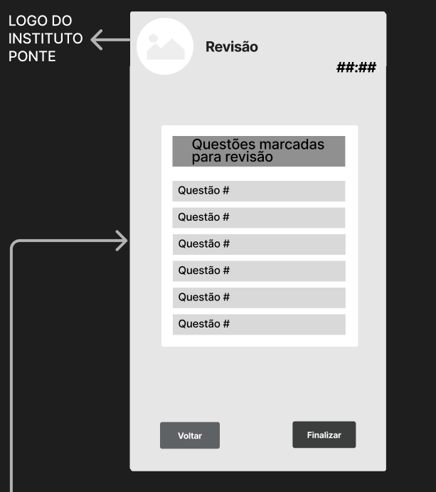
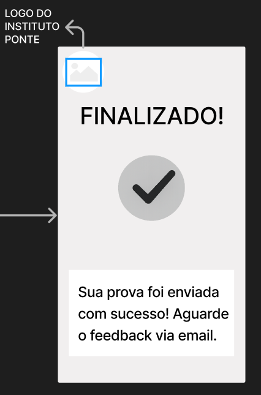
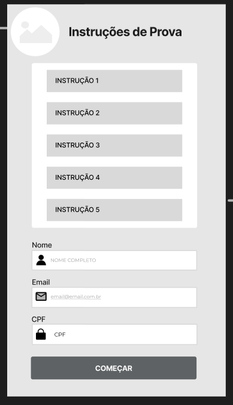

Drive com as fotos do rascunho da diagramação de classes UML da prova:
https://drive.google.com/drive/folders/10WWE-NGI_FWsrd9DImUuJKm3mLXaZSVB?usp=drive_link

Documento com as telas que vão ser criadas dentro do wireframe da visualização do professor:
Link: https://docs.google.com/document/d/17ugWiNUdEXpgIERscrRcl4eRig97YaL5LyF2QrLrwDo/edit?usp=sharing

Repositório do GitHub com o pacote CLI feito para otimizar o fluxo de criação de issues -> commits -> merge requests:
Através dele é possível realizar todo o fluxo de trabalho sem sair do VSCODE
https://github.com/misareverberate/gitlab-flow-cli

Documento com o UML do coordenador:
Link: https://app.diagrams.net/#G1hemkDsNpLL-8a8fV2t_MGrsL2OiyIz75#%7B%22pageId%22%3A%22_FvIqp9UhPcbmpztyfYB%22%7D

Estou fazendo estudo sobre Diagramas UML e aqui está minha conversa com a IA Chat GPT que me ajudou a ter um maior entendimento do assunto:
https://chatgpt.com/share/69fccf6f-4e34-83e9-a05d-78fc0ff365ff  
Documento com as UMLs do Aluno:
https://app.diagrams.net/#G1hemkDsNpLL-8a8fV2t_MGrsL2OiyIz75#%7B%22pageId%22%3A%22_FvIqp9UhPcbmpztyfYB%22%7D

Pablo Marchina: feat(#60): adiciona diagrama de classes do módulo do professor
Link: https://drive.google.com/file/d/1ObtlEZbTAccfOR6JpRT5S028EKOYxSlw/view?usp=sharing

Documento com as telas que vão ser criadas dentro do wireframe da visualização do Coordenador:
Link: https://docs.google.com/document/d/1adqqXx2N4uJE0ki3xl4QfUgMcVTBYQD7d1hoESxnQkk/edit?tab=t.0

Joana: link do Figma - utilizado para fazer o Wireframe do aluno:
https://www.figma.com/design/hT0ZlGn9DAz64Y1gIwFVrM/Sem-t%C3%ADtulo?node-id=0-1&t=RCH7vGXuLSJq8vto-1
07/05 - Criação de telas

  

11/05 - Criação da tela de revisão, de envio, e edição da tela de instruções

  

  

  

# Relatório diário do processo de criação do diagrama de classes do sistema de banco de dados

## Registro diário:

### Data: 07/05/2026

### Desenvolvedora: Heloisa Kadota

### Objetivo do dia:

Terminar o planejamento das interações das tabelas UMLs do banco de dados e validar com a equipe e professor.

### Adições feitas:

Foi finalizada a imagem para ser utilizada de referência para o resto do banco de dados do projeto.

https://drive.google.com/drive/folders/1RXmUKvEuwlyquJh1gMrSHw_IkdPJoKEN?usp=drive_link

# Relatório diário do processo de criação do modelo entidade-relacionamento

## Registro diário:

### Data: 11/05/2026

### Desenvolvedora: Heloisa Kadota

### Objetivo do dia:

Criar e colocar no WAD o modelo entidade-relacionamento seguindo as instruções de formatação informadas pelo professor.

### Adições feitas:

Foi criado o modelo entidade-relacionamento do projeto, com notação de crows foot consistente e com atribuição de atributos e outros detalhes no código PlantUML.

Matheus Almeida - Aqui segue o link do figma no qual eu fiz a criação dos componentes que serão utilizados ao longo de todo o wireframe do professor, além de criar a base das telas:
https://www.figma.com/design/hT0ZlGn9DAz64Y1gIwFVrM/Sem-t%C3%ADtulo?node-id=17-207&t=twulAasgSiWiIlT8-1
